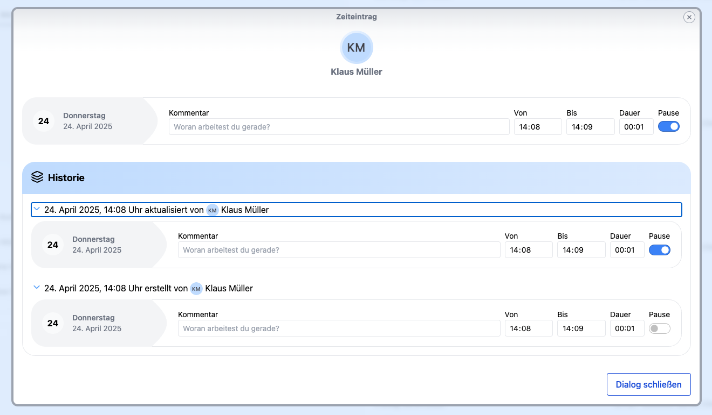

Das **Release 2.16.0** bietet eine wichtige Neuerung: die Einführung der **Änderungshistorie für Zeiteinträge**. Diese Funktion ermöglicht es, alle Änderungen, die an Zeiteinträgen vorgenommen wurden, zu verfolgen und gibt so eine detaillierte Übersicht über die Historie von Zeiteinträgen.

<!-- more -->

## Verbesserungen

### Änderungshistorie an Zeiteinträgen

Das EuGH-Urteil zur Arbeitszeiterfassung fordert ein objektives, verlässliches und zugängliches System zur Dokumentation der Arbeitszeit. Dies bedeutet, dass die erfassten Daten der Arbeitszeit objektiv und verlässlich sein müssen, und sowohl Arbeitgeber als auch Arbeitnehmer Zugriff darauf haben müssen.

Mit diesem Release können nun alle **Änderungen an Zeiteinträgen** anhand des Histoy-Icons nachverfolgt werden.

    <figure>
        <picture>
            
        </picture>
        <figcaption class="text-sm text-center">Zeiteintrag mit History-Icon</figcaption>
    </figure>

Jede Änderung wird in einer übersichtlichen Historie gespeichert, die den **Verlauf** der Zeiteinträge dokumentiert. 
Dies ist besonders nützlich, um **Fehler** zu korrigieren und nachzuvollziehen, wer wann eine Änderung vorgenommen hat.

    <figure>
        <picture>
            
        </picture>
        <figcaption class="text-sm text-center">Historie zum Zeiteintrag</figcaption>
    </figure>

**Warum ist das wichtig?**  
Die **Nachverfolgbarkeit** von Änderungen an Zeiteinträgen ist für Unternehmen und Teams von großer Bedeutung. Sie ermöglicht eine **größere Transparenz** und eine verbesserte **Datenintegrität**. Durch die Änderungshistorie können **Fehlerquellen** schneller identifiziert und behoben werden. Auch für Audits oder **Compliance-Anforderungen** kann diese Funktion von großer Bedeutung sein.

## Fazit

**Release 2.16.0** bringt eine **wertvolle Neuerung** in der Zeiterfassungssoftware: die **Änderungshistorie für Zeiteinträge**. Diese Funktion trägt zur Verbesserung der **Datenintegrität** bei und sorgt für mehr **Transparenz** und **Nachvollziehbarkeit** bei der Verwaltung von Zeiteinträgen.

Zur vollständigen Release-Übersicht: [Release 2.16.0 auf GitHub ansehen](https://github.com/urlaubsverwaltung/zeiterfassung/releases/tag/zeiterfassung-2.16.0)
