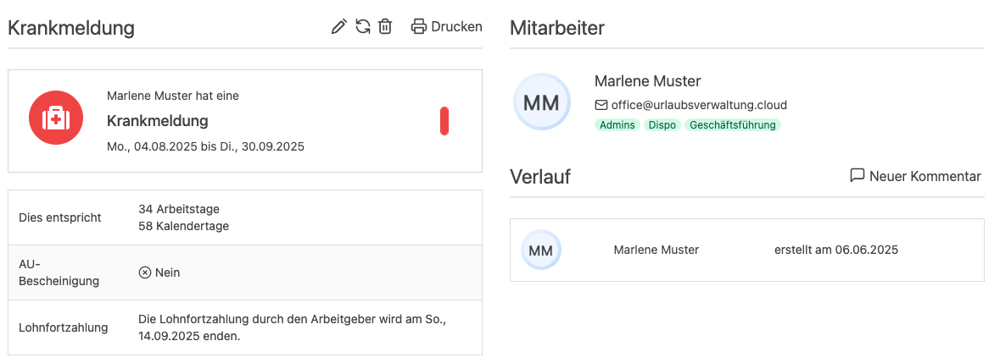

Die Urlaubsverwaltung hat ein neues Update erhalten – und das bringt einige sinnvolle Erweiterungen für Personalabteilungen und Mitarbeitende mit sich. Mit der **Version 5.22.0** setzen wir auf mehr **Transparenz**, **Nutzerfreundlichkeit** und eine präzisere **Darstellung wichtiger Informationen**

<!-- more -->

## Hinweis auf Verfall von Urlaub

Verbesserte Transparenz: Ab sofort wird **direkt in der Erinnerungsmail angezeigt**, wann ein **Resturlaub verfällt**. 
So behalten Mitarbeitende den Überblick und verpassen keine Fristen mehr – und die HR-Abteilung spart sich Rückfragen.

**Vorteil:** Frühzeitige Planung wird gefördert und unerwarteter Urlaubsverlust verhindert.

## Verbesserte Anzeige bei Krankmeldungen: Kalendertage und Lohnfortzahlung

In der Detailansicht einer Krankmeldung werden nun **Kalendertage** und **Zeiträume mit Lohnfortzahlung** sichtbar dargestellt.
Insbesondere wird dargestellt, wenn es **keine Entgeltfortzahlung** während der Krankheitszeit gibt – z. B. bei längerer Krankheit über die gesetzlichen sechs Wochen hinaus.
Das schafft mehr Transparenz über den Verlauf einer Krankheitsphase.

    <figure>
        <picture>
            
        </picture>
        <figcaption class="text-sm text-center">Details einer Krankmeldung inklusive Informationen zur Lohnfortzahlung</figcaption>
    </figure>

**Vorteil:** Arbeitgeber und Arbeitnehmer erkennen sofort, wie sich die Krankmeldung auf Gehalt und Abwesenheit auswirkt.

## Neuer Sonderurlaub: Betriebsjubiläen

Ein Meilenstein im Unternehmen verdient auch Anerkennung:
Laut Tarifvertrag der Länder (TV-L) haben Angehörige des öffentlichen Dienstes Anspruch auf jeweils einen Tag Urlaub am 25. und 50. Betriebsjubiläum.

Mit diesem Release ist es möglich, beim Antrag auf Sonderurlaub, die Anzahl der freien Tage zum **Betriebsjubiläen** anzuzeigen. 
Das minimiert die notwendige Kommunikation und sorgt für klare Abläufe.

**Vorteil:** Personalabteilungen können Jubiläen systematisch würdigen – Mitarbeitende fühlen sich gesehen und wertgeschätzt.

## Fazit

Mit Version 5.22.0 zeigt die Urlaubsverwaltung, wie kleine Verbesserungen große Wirkung entfalten: **mehr Übersicht**, **mehr Fairness**, **mehr Effizienz**. Egal ob Urlaub, Krankheit oder Jubiläum – der Umgang mit Abwesenheiten wird für alle Beteiligten einfacher und transparenter.

Zur vollständigen Release-Übersicht: [Release 5.22.0 auf GitHub ansehen](https://github.com/urlaubsverwaltung/urlaubsverwaltung/releases/tag/urlaubsverwaltung-5.22.0)
