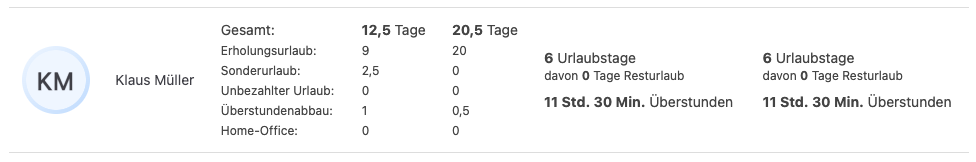
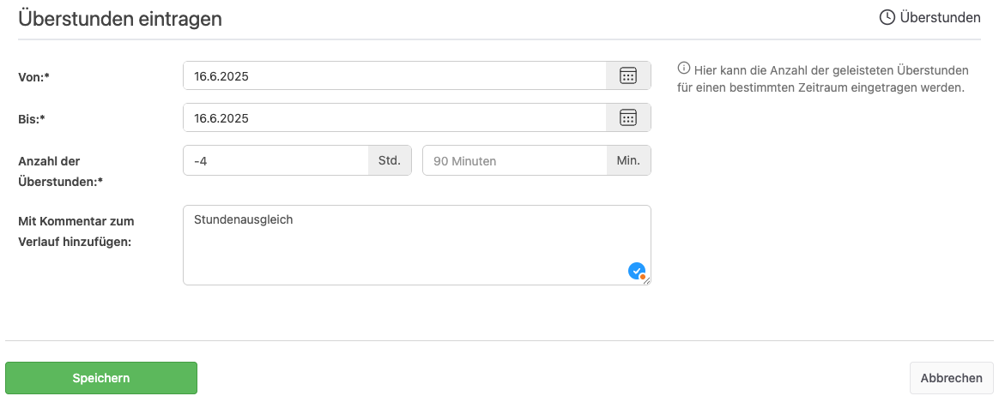

Das **Release 5.23.0** der **Urlaubsverwaltung** bringt spannende neue **Funktionen** sowie **Verbesserungen**. 
Besonders hervorzuheben ist die Möglichkeit für Benutzende, die **Abwesenheitsstatistik** einzusehen. 
Darüber hinaus ist es ab jetzt möglich initial **negative Überstunden** zu erheben.

<!-- more -->

## Neue Funktionen

### Abwesenheitsstatistik für Benutzende einsehbar

Mit diesem Update können Benutzende nun eine **Abwesenheitsstatistik** einsehen, die es ihnen ermöglicht, ihre vergangenen und geplanten Abwesenheiten schnell zu überprüfen. Diese Funktion bietet eine Übersicht über **Urlaubstage**, **Krankmeldungen** und andere relevante Abwesenheiten und hilft dabei, eine bessere Übersicht und Planung zu gewährleisten.

    <figure>
        <picture>
            
        </picture>
        <figcaption class="text-sm text-center">Einblick in die Abwesenheitsstatistik</figcaption>
    </figure>

**Warum ist das wichtig?**  
Diese Funktion erleichtert Benutzern die **Selbstkontrolle** über ihre **Abwesenheitszeiten** und fördert eine transparentere Verwaltung von Urlaub und Krankheitstagen. Besonders nützlich für **Personalabteilungen** und **Mitarbeiter**, die ihre Abwesenheiten genau im Blick behalten müssen.

## Verbesserungen

### Initiales Anlegen von negativen Überstunden mit Minus (-10 z.B.) möglich

Mit diesem Update ist es möglich, **negative Überstunden** zu erstellen (z.B. -10 Stunden). 
Ab jetzt können **negative Überstunden** korrekt angelegt werden, was für **Überstundenabbau** oder **Guthaben** von Bedeutung ist.

    <figure>
        <picture>
            
        </picture>
        <figcaption class="text-sm text-center">Formular zum Eintragen von Minusstunden</figcaption>
    </figure>

**Warum ist das wichtig?**  
Für die **Überstundenverwaltung** ist es entscheidend, dass sowohl **positive als auch negative Stunden** korrekt erfasst werden können. 
Mit diesem Fix können Unternehmen **negative Überstunden** zur Reduzierung von Arbeitszeitguthaben oder Abbau von Überstunden nutzen.

## Fazit

Das **Release 5.23.0** bietet einige nützliche **Erweiterungen**, insbesondere die Möglichkeit für Benutzer, 
ihre **Abwesenheitsstatistik** einzusehen. Zudem wurden behoben: **Anlage von negativen Überstunden**.

Zur vollständigen Release-Übersicht: [Release 5.23.0 auf GitHub ansehen](https://github.com/urlaubsverwaltung/urlaubsverwaltung/releases/tag/urlaubsverwaltung-5.23.0)
