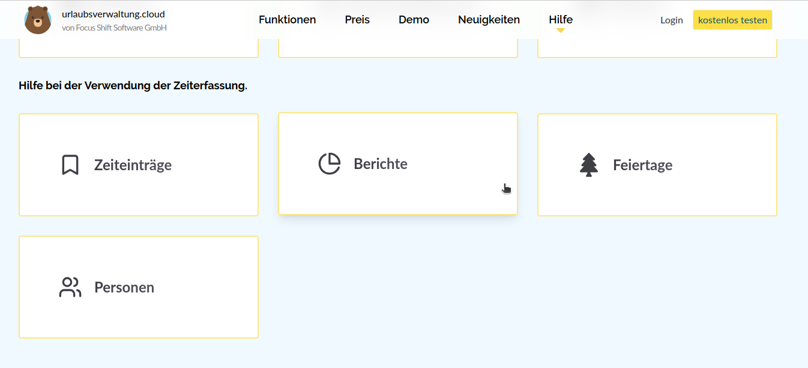

Hilfe der Zeiterfassung. Die Hilfe ist übersichtlich in vier Bereiche unterteilt: Zeiteinträge, Berichte, Personen und Feiertage.
So findest du schneller die passenden Informationen und kannst die Zeiterfassung noch effizienter nutzen.

<!-- more -->

## Neue Hilfe-Funktion im Avatar-Menü für die Zeiterfassung

Ab sofort findest du im **Avatar-Menü** einen direkten Zugang zur [**Hilfe-Seite der Zeiterfassung**](https://urlaubsverwaltung.cloud/hilfe/#dokumentation-zeiterfassung) – damit du noch schneller und einfacher Antworten auf deine Fragen bekommst.

    <figure>
        <picture>
            <source srcset="help.avif" type="image/avif" />
            <source srcset="help.webp" type="image/webp" />
            
        </picture>
        <figcaption class="text-sm text-center">Hilfe der Zeiterfassung auf urlaubsverwaltung.cloud</figcaption>
    </figure>

Die Hilfe ist übersichtlich in vier zentrale Bereiche gegliedert:

- **Zeiteinträge**  
  Erfahre alles rund um das Erfassen, Bearbeiten und Verwalten deiner Zeiteinträge und die für deine Mitarbeitenden. Ob manuelle Einträge oder automatische Zeiterfassung – diese Sektion führt dich Schritt für Schritt durch alle Funktionen.  
  [Hilfe zu Zeiteinträgen](https://urlaubsverwaltung.cloud/hilfe/zeiterfassung/zeiteintraege/)

- **Berichte**  
  Lerne, wie du aussagekräftige Berichte erstellst, analysierst und exportierst. Egal individuelle Auswertungen oder Teamübersichten – hier findest du alle wichtigen Informationen.  
  [Hilfe zu den Berichten](https://urlaubsverwaltung.cloud/hilfe/zeiterfassung/berichte/)

- **Personen**  
  Hier erfährst du, wie du Mitarbeitende verwaltest und Berechtigungen definierst. Zusätzlich gibt es Informationen zur Konfiguration von individuellen Arbeitszeiten und Überstundenregelungen.  
  [Hilfe zu Personen](https://urlaubsverwaltung.cloud/hilfe/zeiterfassung/personen/)

- **Feiertage**  
  Wie werden Feiertage berücksichtigt? Wie kannst du die globale Feiertagsregelung für Mitarbeitenden anpassen?  
  [Hilfe zu Feiertagen](https://urlaubsverwaltung.cloud/hilfe/zeiterfassung/feiertage/)

Dank der neuen Struktur findest du schneller die Informationen, die du brauchst – direkt erreichbar über dein Avatar-Menü.
