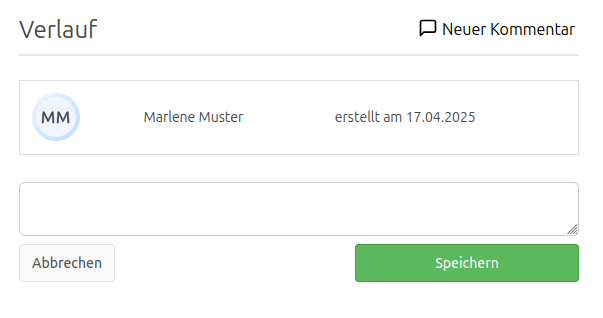

Das **Release 5.24.0** ermöglicht es einheitlich Kommentare ohne das Bearbeiten von Krankmeldungen, Urlaubsanträgen und Überstunden hinzuzufügen. Dies verbessert die Kommunikation und den Verlauf der Abwesenheiten.

<!-- more -->

## Verbesserungen

### Kommentare bei Urlaubsanträgen und Überstunden direkt hinzufügen

Bisher war es nur möglich, Kommentare zu Krankmeldungen hinzuzufügen, ohne diese zu bearbeiten. Dies geschah über "Neuer Kommentar" in der Detailansicht.

    <figure>
        <picture>
            
        </picture>
        <figcaption class="text-sm text-center">Kommentar direkt zum Verlauf hinzufügen</figcaption>
    </figure>

Ab sofort ist es auch möglich, Kommentare bei **Urlaubsanträgen** und **Überstunden direkt hinzuzufügen**, ohne den Antrag oder die Überstunden zu bearbeiten.

> **Warum ist das wichtig?**  
> Urlaubsanträge und Überstunden müssen nicht mehr bearbeitet werden, um einen Kommentar zum Verlauf hinzuzufügen. Dies erleichtert es den Verlauf zu verwenden und die Kommunikation zu verbessern.

## Fazit

Das **Release 5.24.0** macht es einfacher, Kommentare zu Abwesenheiten hinzuzufügen, ohne die Abwesenheit selbst zu bearbeiten.

Zur vollständigen Release-Übersicht: [Release 5.24.0 auf GitHub ansehen](https://github.com/urlaubsverwaltung/urlaubsverwaltung/releases/tag/urlaubsverwaltung-5.24.0)
