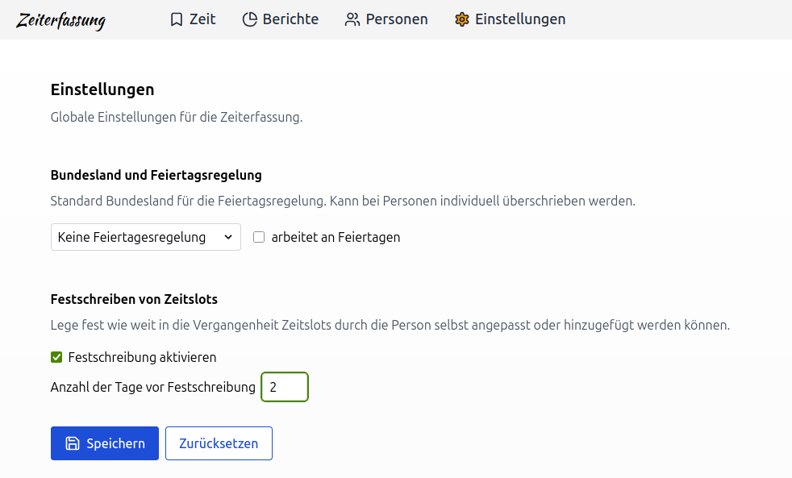
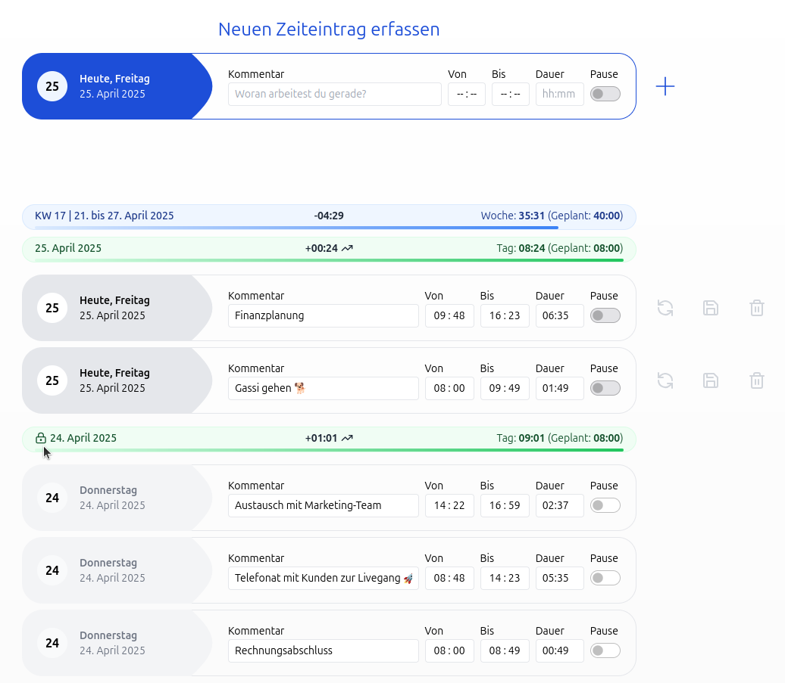

Release **2.21.0** bringt das Festschreiben von Zeiteinträgen.

<!-- more -->

## Festschreiben von Zeiteinträgen

Das Hinzufügen und Ändern von Zeiteinträgen kann, seit dem Release 2.21.0, ab einem bestimmten Datum verhindert werden, um sie vor Änderungen zu schützen.
Dies ist besonders wichtig, wenn die Zeitbuchungen für die Lohnabrechnung verwendet werden.

In der Zeiterfassung können Personen mit der Berechtigung "darf die globalen Einstellungen bearbeiten" unter
'Einstellungen > Festschreiben von Zeitslots' einstellen nach wie vielen Tagen Zeiteinträge für die Mitarbeitenden festgeschrieben werden sollen.

  <picture>
    
  </picture>

Festgeschriebene Zeiteinträge und das Hinzufügen neuer Zeiteinträgen für einen Tag, welcher festgeschrieben ist,
ist nur für Mitarbeitende mit der Berechtigung "darf die Zeiteinträge aller Personen bearbeiten" möglich.

Tage, an denen die Zeiteinträge festgeschrieben sind, sind in der Übersicht mit einem Schloss-Symbol gekennzeichnet.
Dies bedeutet, dass an diesem Tag keine weiteren Zeiteinträge hinzugefügt bzw. keine Zeiteinträge bearbeitet werden können.

  <picture>
    
  </picture>

Für Personen mit der Berechtigung "darf die globalen Einstellungen bearbeiten" wird das Schloss-Symbol angezeigt.
Diese können aber weiterhin neue Zeiteinträge hinzufügen bzw. bearbeiten.

> **Warum ist das wichtig?**  
> Das Festschreiben von Zeiteinträgen ist eine wichtige Funktion, um die Integrität der Daten zu gewährleisten und sicherzustellen,

## Fazit

**Release 2.21.0** bringt eine wichtige Erweiterung der Zeiterfassung. Das Festschreiben von Zeiteinträgen ist eine wichtige Funktion,
um die Integrität der Daten zu gewährleisten und sicherzustellen, dass keine Änderungen an den Zeiteinträgen vorgenommen ab einem bestimmten Zeitpunkt mehr vorgenommen werden können.

Zur vollständigen Release-Übersicht: [Release 2.21.0 auf GitHub ansehen](https://github.com/urlaubsverwaltung/zeiterfassung/releases/tag/zeiterfassung-2.21.0)
