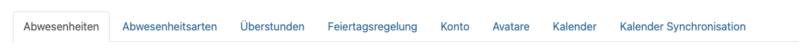
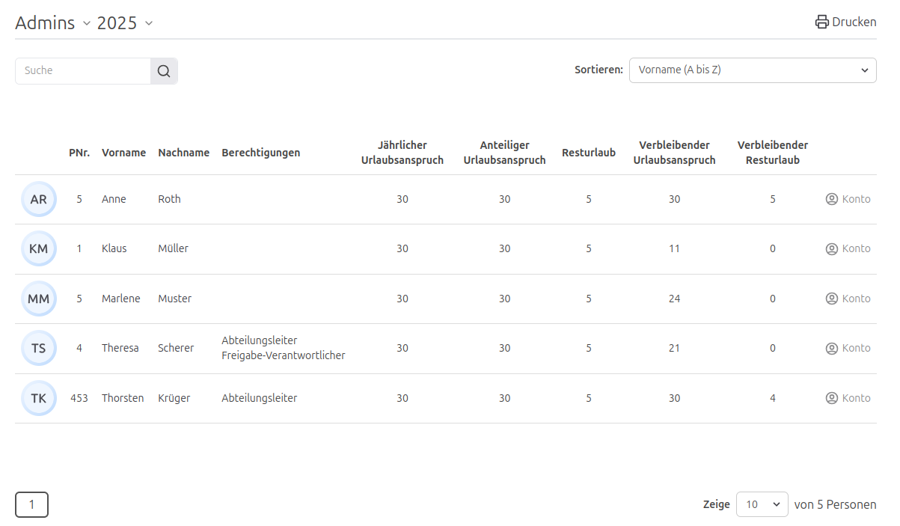

Im Release **5.25.0** haben wir die Einstellungen in Unterkategorien aufgeteilt und die Berechtigungen für Abteilungsleiter und Freigabe-Verantwortliche angepasst.

<!-- more -->

## Editieren von Abwesenheiten für Abteilungsleiter und Freigabe-Verantwortliche

Abteilungsleiter und Freigabe-Verantwortliche dürfen nun auch die Abwesenheiten von Personen bearbeiten, für die sie verantwortlich sind.
Bisher war dies nicht möglich und der Abteilungsleiter oder Freigabe-Verantwortliche musste den Antrag zunächst löschen und neu anlegen oder
diese Aufgabe an eine Person mit der Berechtigung „Office“ abgeben.

Durch diese Anpassung wird das autonome Arbeiten für Abteilungsleiter und Freigabe-Verantwortliche erleichtert.
Die entsprechende Berechtigung wird automatisch hinzugefügt, sofern die Person bereits über die Berechtigung "Pflege von Abwesenheiten" verfügt.

## Aufteilung der Einstellungen

Die Einstellungen der Urlaubsverwaltung wurden in weitere Unterkategorien aufgeteilt. Dadurch wird die Übersichtlichkeit erhöht.
Zudem wird die Navigation innerhalb der Einstellungen erleichtert.

Die Einstellungen sind nun in folgende Kategorien unterteilt:

- Abwesenheiten
- Abwesenheitsarten
- Überstunden
- Feiertagsregelung
- Konto
- Avatare
- Kalender
- Kalender Synchronisation

    <figure>
        <picture>
            
        </picture>
        <figcaption class="text-sm text-center">Übersicht der Einstellungskategorien</figcaption>
    </figure>

## Berechtigungen der personen einer Abteilung wird angezeigt

Bisher musste man eine Abteilung bearbeiten, um die Berechtigungen der Personen darin einzusehen.
Die Berechtigungen einer Person können ab jetzt direkt in der Übersicht der entsprechenden Abteilung eingesehen werden.
Das erleichtert die Verwaltung der Berechtigungen.

    <figure>
        <picture>
            
        </picture>
        <figcaption class="text-sm text-center">Abteilungsübersicht mit Berechtigungen</figcaption>
    </figure>

## Fazit

**Release 5.25.0** bringt spürbare Verbesserungen für die tägliche Arbeit mit sich. Abteilungsleiter und Freigabe-Verantwortliche
erhalten durch die Möglichkeit, Abwesenheiten direkt zu bearbeiten, mehr Autonomie und Flexibilität.
Gleichzeitig sorgt die neue, übersichtlichere Struktur der Einstellungen für eine bessere Benutzerführung und erleichtert
das Auffinden relevanter Einstellungen. Darüber hinaus verbessert die direkte Anzeige der Berechtigungen innerhalb der
Abteilungsübersicht die Transparenz und Effizienz in der Berechtigungsverwaltung.

Zur vollständigen Release-Übersicht: [Release 5.25.0 auf GitHub ansehen](https://github.com/urlaubsverwaltung/urlaubsverwaltung/releases/tag/urlaubsverwaltung-5.25.0)
