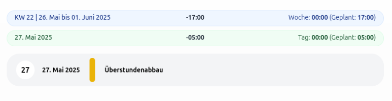

Wir freuen uns riesig, ein Feature zu präsentieren, auf das viele von euch lange gewartet haben: ab sofort synchronisieren sich Überstunden und Minusstunden automatisch zwischen unserer Zeiterfassungssoftware und der Urlaubsverwaltung – für mehr Transparenz, weniger Verwaltungsaufwand und eine reibungslose HR-Erfahrung!

<!-- more -->

## Was genau macht das neue Feature?

Unsere beiden Anwendungen – Zeiterfassung und Urlaubsverwaltung – sind schon heute in vielen Unternehmen im Einsatz, sowohl als Open Source als auch als SaaS.
Unsere SaaS Kunden haben bereits seit einiger Zeit die Möglichkeit, Abwesenheiten wie Urlaub, Krankheit oder Homeoffice in der Urlaubsverwaltung zu erfassen
und diese Informationen in der Zeiterfassung zu berücksichtigen.
Bisher mussten Überstunden und deren Abbau jedoch manuell gepflegt werden.

Damit ist jetzt Schluss:

## So funktioniert die neue Synchronisierung:

- Überstunden und Minusstunden, die in der Zeiterfassung anfallen, werden automatisch in die Urlaubsverwaltung übertragen.

- Wird in der Urlaubsverwaltung ein Überstundenabbau beantragt und genehmigt, wird diese Information an die Zeiterfassung übertragen.

    <figure>
        <picture>
            
        </picture>
        <figcaption class="text-sm text-center">Überstundenabbau in der Zeiterfassung</figcaption>
    </figure>

- In der Folge müssen an diesen Tagen keine oder reduzierte Arbeitsstunden erfasst werden – die Abwesenheit wird automatisch bei den Soll-Stunden berücksichtigt.

## Warum ist das wichtig?

#### 1. Spart Zeit in der HR und für Mitarbeitende

Keine doppelten Einträge, kein ständiges Abgleichen mehr. Einmal buchen – überall korrekt.

#### 2. Erhöht die Transparenz

Mitarbeitende sehen auf einen Blick, wie viele Überstunden sie haben und wie viel sie bereits abgebaut haben

#### 3. Reduziert Fehlerquellen

Weniger manuelle Übertragung = weniger Risiko für Ungenauigkeiten oder Missverständnisse.

#### 4. Perfekt für hybride Teams und moderne Arbeitsmodelle

In Zeiten von Gleitzeit, Homeoffice und flexibler Arbeitszeit wird es umso wichtiger, dass Systeme intelligent miteinander sprechen.

## Für wen ist dieses Feature verfügbar?

Das Feature ist ab sofort in unseren SaaS-Versionen beider Tools enthalten. Es benötigt keine zusätzliche Einrichtung, sondern lässt sich direkt über die Einstellungen aktivieren – die nötigen Synchronisationsschnittstellen sind bereits integriert.

## Wir freuen uns über euer Feedback!

Wie immer gilt: Wir entwickeln unsere Produkte gemeinsam mit euch weiter. Testet das neue Feature, sagt uns, wie es euch gefällt – und was ihr euch als Nächstes wünscht!
