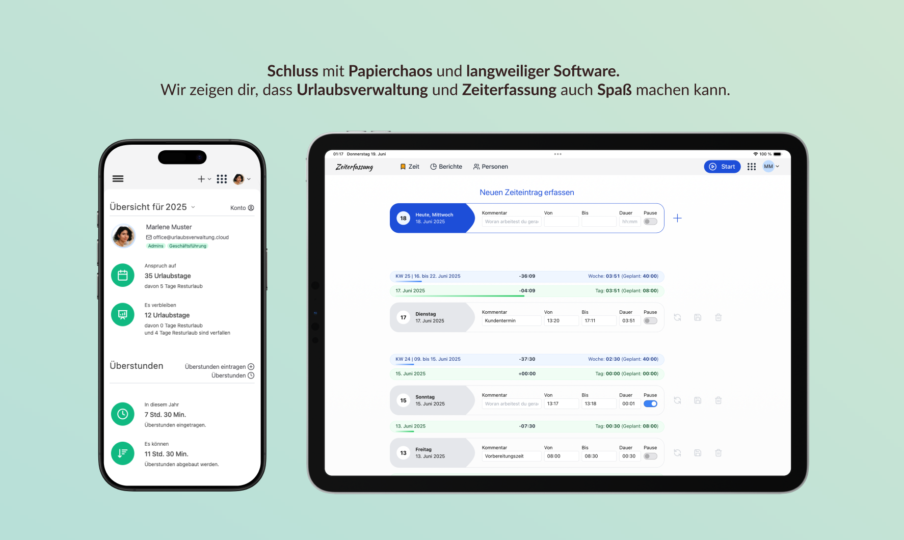

Wir freuen uns sehr, euch heute ein ganz besonderes Update präsentieren zu können:
Ab sofort ist die **urlaubsverwaltung.cloud Mitarbeiter-App auch für iOS verfügbar!** Damit können deine Mitarbeitenden jetzt noch einfacher und flexibler Abwesenheiten beantragen und Arbeitszeiten erfassen – direkt vom iPhone oder iPad.

<!-- more -->

## Was kann die iOS-App?

Mit der neuen iOS-App stehen dir und deinem Team alle wichtigen Funktionen der Urlaubsverwaltung und Zeiterfasssung auch unterwegs zur Verfügung:

- **Abwesenheiten beantragen:** z.B. Erholungsurlaub, Krankheit oder Homeoffice können direkt über die App beantragt bzw. eingetragen werden.
- **Arbeitszeiten erfassen:** Die Zeiterfassung ist jederzeit griffbereit – inklusive Stoppuhr-Funktion.
- **Übersicht behalten:** Alle Anträge, Urlaubsansprüche und Arbeitszeiten auf einen Blick.
- **Synchronisation:** Alle Daten werden automatisch mit der Web-Anwendung synchronisiert – keine lokalen Daten auf dem Gerät.

  <picture>
    
  </picture>

## Für wen ist die App gedacht?

Die App richtet sich an alle Organisationen, die urlaubsverwaltung.cloud als SaaS-Lösung nutzen.
Sie ist für alle Mitarbeitenden gedacht, die ihre Abwesenheiten und Arbeitszeiten bequem vom Smartphone oder Tablet aus verwalten möchten.

## So bekommst du die App

Die iOS-App steht ab sofort kostenlos im [Apple App Store](https://apps.apple.com/us/app/urlaubsverwaltung-cloud/id6747396834) zum Download bereit.
Natürlich gibt es die App weiterhin auch für [Android im Google Play Store](https://play.google.com/store/apps/details?id=cloud.urlaubsverwaltung.mobile.urlaubsverwaltung&gl=DE).

## Wir freuen uns auf euer Feedback!

Wie immer gilt: Wir entwickeln unsere Produkte gemeinsam mit euch weiter.
Testet die neue iOS-App, gebt uns Feedback und sagt uns, was ihr euch als Nächstes wünscht!

Bei Fragen oder Anregungen erreicht ihr uns jederzeit per [E-Mail](mailto:info@urlaubsverwaltung.cloud?subject=iOS%20App%20Feedback) oder telefonisch unter 0721 98614542.

---

Zur Übersicht aller Neuigkeiten: [Alle News anzeigen](/neuigkeiten/)

