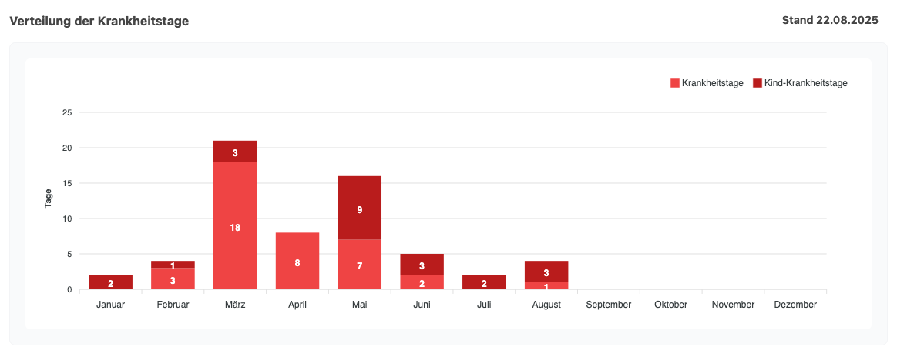
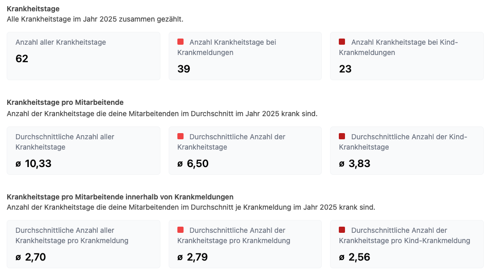
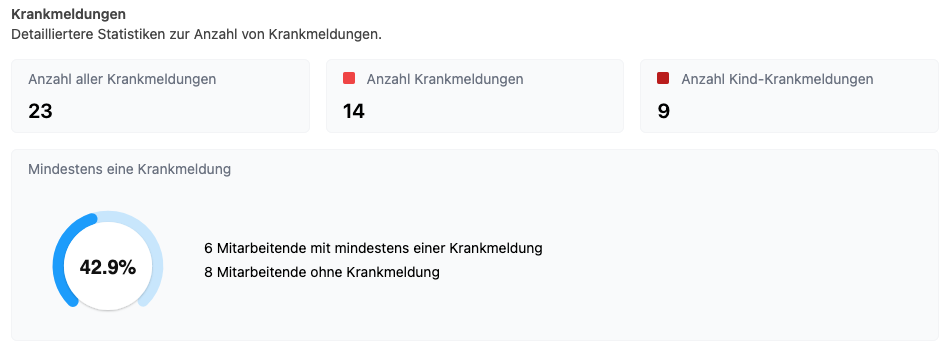

Im Release **5.28.0** wurden die Statistiken zu Krankmeldungen überarbeitet und komplett neu gedacht.
Neben einer frischen Visualisierung stehen nun auch detailliertere Auswertungen zur Verfügung, die mehr Einblick in Krankmeldungen geben.
So entsteht ein klareres Bild darüber, wie sich Krankheitstage im Unternehmen entwickeln und welche Faktoren dabei eine Rolle spielen können.

<!-- more -->

## Gesundheit im Blick behalten – auch im Arbeitsalltag

Das Thema Mental Health und die allgemeine Gesundheit von Mitarbeitenden rückt immer stärker in den Fokus moderner Unternehmen. Krankheitstage sind dabei nicht nur eine Kennzahl, sondern auch ein Signal für Belastung, Stress oder Überlastung. Wer diese Entwicklungen frühzeitig erkennt, kann besser reagieren – sei es mit Präventionsangeboten, gezielten Entlastungen oder offener Kommunikation. Die neuen Krankmeldungsstatistiken in der Urlaubsverwaltung sind ein Werkzeug, um genau hier mehr Transparenz und Verständnis zu schaffen.

## Die neue Krankmeldungsstatistik im Detail

Neben einer klaren Visualisierung im Jahresverlauf können jetzt auch vergangene Jahre ausgewählt werden. So lassen sich Trends erkennen und Veränderungen im Unternehmen über die Zeit hinweg nachvollziehen.

Die Darstellung erfolgt natürlich basierend auf den Berechtigungen:

* **Office und Chef** erhalten eine Übersicht über die gesamte Organisation.
* **Abteilungsleitung und Freigabeberechtigte** sehen die Daten nur für die Abteilungen, für die sie zuständig sind.

Damit bleibt die Vertraulichkeit gewahrt, während gleichzeitig die jeweils relevanten Informationen zur Verfügung stehen.

    <figure>
        <picture>
            
        </picture>
        <figcaption class="text-sm text-center">Verteilung der Krankheitstage über das Kalenderjahr als Balkendiagramm</figcaption>
    </figure>

    <figure>
        <picture>
            
        </picture>
        <figcaption class="text-sm text-center">Informationen zu den Krankheitstagen aufgeschlüsselt nach Kategorie (Normale Krankmeldung und Kind-Krankmeldung)</figcaption>
    </figure>

    <figure>
        <picture>
            
        </picture>
        <figcaption class="text-sm text-center">Informationen zu den Krankmeldungen aufgeschlüsselt nach Kategorie (Normale Krankmeldung und Kind-Krankmeldung)</figcaption>
    </figure>

## Ein erster Schritt zu mehr Bewusstsein

Die neuen Auswertungen sind mehr als nur Zahlen und Diagramme. Sie sind ein erster Schritt, um im Unternehmen ein Bewusstsein für Gesundheit zu schaffen. Wenn sichtbar wird, wann und wie oft Krankmeldungen auftreten, lassen sich Muster erkennen – und vor allem Maßnahmen ableiten, die Mitarbeitende nachhaltig entlasten können.

## Fazit

Mit Release **5.28.0** bringt die Urlaubsverwaltung eine komplett überarbeitete Sicht auf Krankmeldungen ins Unternehmen. Durch die **klaren Visualisierungen**, die Möglichkeit, auch **vergangene Jahre** einzusehen, und die Steuerung der Zugriffe über Berechtigungen entsteht eine solide Basis, um Gesundheit und Arbeitsbelastung besser wahrzunehmen.

Die neuen Statistiken sind damit nicht nur ein praktisches Werkzeug für Transparenz, sondern auch ein wichtiger Impuls, das Thema Gesundheit im Unternehmen bewusster zu betrachten und aktiv zu fördern.

## Ausblick

Mit der neuen Krankmeldungsstatistik ist der Grundstein gelegt. In kommenden Versionen wird die Auswertung weiter ausgebaut:

* Die **Krankenquote** wird als zentrale Kennzahl integriert, sodass Unternehmen noch schneller einen Überblick über die gesundheitliche Situation bekommen.
* Außerdem wird es möglich sein, **direkte Vergleiche mit dem Vorjahr** vorzunehmen, um Entwicklungen und Trends besser sichtbar zu machen.

So wächst die Statistik Schritt für Schritt zu einem umfassenden Werkzeug, das nicht nur Zahlen liefert, sondern echte **Einblicke in die Gesundheit der Organisation** ermöglicht.

## Wir freuen uns über euer Feedback!

Wie immer gilt: Wir entwickeln unsere Produkte gemeinsam mit euch weiter. Testet das neue Feature, sagt uns, wie es euch gefällt – und was ihr euch als Nächstes wünscht!

Zur vollständigen Release-Übersicht: [Release 5.28.0 auf GitHub ansehen](https://github.com/urlaubsverwaltung/urlaubsverwaltung/releases/tag/urlaubsverwaltung-5.28.0)
