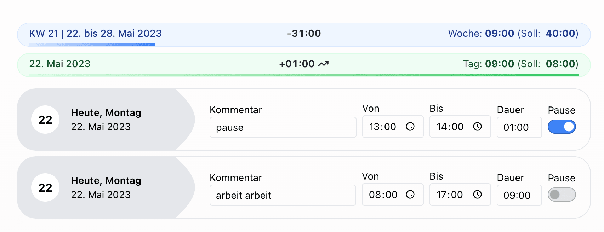
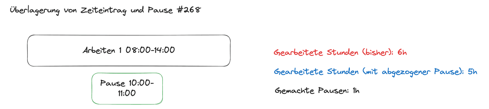
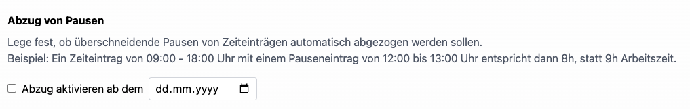

Mit dem neuesten Update unserer Zeiterfassung führen wir eine wichtige Änderung ein, die sowohl die rechtliche 
Genauigkeit als auch die Transparenz der Zeiterfassung verbessert. Ziel ist es, Arbeits- und Pausenzeiten 
realitätsgetreuer abzubilden und dadurch verlässliche Arbeitszeitnachweise zu ermöglichen.

<!-- more -->

## Bisheriges Verhalten

Bislang wurden Pausen rein informativ erfasst. Das bedeutete:

* Arbeits- und Pausenzeiteinträge konnten sich überschneiden.
* Überschneidungen wurden nicht verrechnet.
* Beispiel: Ein Arbeitszeiteintrag von 8:00 bis 16:00 Uhr sowie eine Pause von 12:00 bis 13:00 Uhr ergaben weiterhin 8 Arbeitsstunden.
* Mitarbeitende erfüllten damit formal ihr Arbeitssoll, auch wenn die Pausenzeit innerhalb des Arbeitszeitraums lag.

    <figure>
        <picture>
            
        </picture>
        <figcaption class="text-sm text-center">Pausen wurden bei Überschneidungen bisher nicht abgezogen.</figcaption>
    </figure>

Diese Methode war einfach, entsprach jedoch nicht den arbeitsrechtlichen Vorgaben, nach denen Arbeit und Pause nicht gleichzeitig stattfinden dürfen.
Der bisher korrekte Weg war, drei Zeiteinträge zu erstellen: Arbeitszeit vor der Pause, Pausenzeit und Arbeitszeit nach der Pause.

## Was ändert sich?

Mit dem Update werden Arbeits- und Pausenzeiten automatisch miteinander verrechnet.

* Überschneidet sich ein Arbeitszeiteintrag mit einem Pauseneintrag, wird die Pausenzeit künftig von der Arbeitszeit abgezogen.
* Beispiel:
Arbeitszeit: 8:00–16:00 Uhr (8 Stunden)
Pause: 12:00–13:00 Uhr (1 Stunde)
Neue Berechnung: 8 Stunden – 1 Stunde Pause = 7 Arbeitsstunden

    <figure>
        <picture>
            
        </picture>
        <figcaption class="text-sm text-center">Pause machen und gleichzeitig arbeiten? Geht nicht! Pausen sollen bei Überschneidung abgezogen werden.</figcaption>
    </figure>

Alternativ kann die Pause natürlich auch – wie bisher – durch getrennte Einträge dargestellt werden (z. B. 8–12 Uhr Arbeit, 12–13 Uhr Pause, 13–16 Uhr Arbeit).
Dies ist weiterhin möglich, jedoch nicht mehr zwingend erforderlich.

## Für wen gilt die Änderung?

* *Neukunden:* Die neue Berechnung ist ab sofort standardmäßig aktiv.
* *Bestandskunden:* Die Änderung kann in den Einstellungen optional aktiviert werden, um bestehende Prozesse nicht ungewollt zu beeinträchtigen.

  <picture>
    
    <figcaption class="text-sm text-center">Einstellung, ab wann der Pausenabzug aktiv ist.</figcaption>
  </picture>

## Was bleibt unverändert?

Das Verhalten bei überschneidenden Arbeitszeiteinträgen bleibt vorerst unverändert. 
Diese werden weiterhin addiert, auch wenn sie sich zeitlich überschneiden. 
Achtung: Dadurch kann es zu Abweichungen zwischen Soll- und Ist-Arbeitszeit kommen.

Wir wissen, dass dieses Thema insbesondere in Richtung Projektzeiterfassung relevant ist. 
Wie wir diesen Bereich künftig gestalten, lassen wir bewusst offen und werden passende Lösungen mit Bedacht und in 
engem Austausch mit unseren Nutzer:innen entwickeln.

## Warum diese Änderung wichtig ist

✔ Rechtskonforme Abbildung von Pausenpflichten

✔ Korrekte Soll-Ist-Vergleiche

✔ Mehr Transparenz für Mitarbeitende und Arbeitgeber

✔ Einfachere Nachvollziehbarkeit bei Prüfungen oder Lohnabrechnungen

✔ Vorbereitung für automatische Pausenerfassung

## Euer Feedback ist mehr als willkommen

Dieses Update ist ein wichtiger Schritt in Richtung genauerer Zeiterfassung – aber nicht der letzte. Wir freuen uns über Rückmeldungen, Ideen oder Anwendungsfälle, die wir künftig berücksichtigen sollen.

Zur vollständigen Release-Übersicht: [Release 2.24.0 auf GitHub ansehen](https://github.com/urlaubsverwaltung/zeiterfassung/releases/tag/zeiterfassung-2.24.0)
