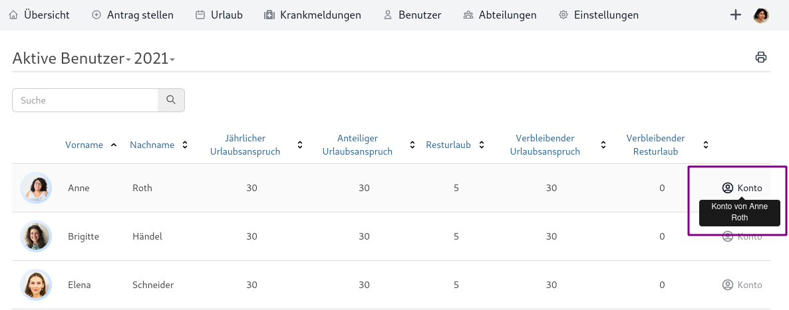
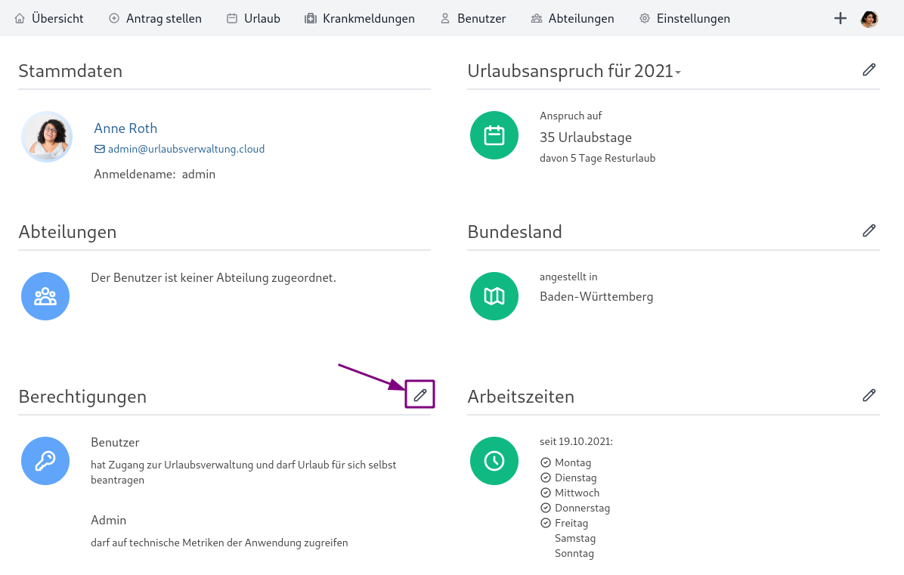

## Welche Berechtigungen gibt es?

In der Urlaubsverwaltung gibt es aktuell folgende Arten von Berechtigungen:

* **Benutzer**: hat Zugang zur Urlaubsverwaltung und darf Urlaub für sich selbst beantragen
* **Abteilungsleiter**: darf Urlaubsanträge für die Benutzer seiner Abteilungen einsehen, genehmigen und ablehnen
* **Freigabe-Verantwortlicher**: ist bei der zweistufigen Genehmigung von Anträgen verantwortlich für die endgültige Freigabe
* **Chef**: darf Urlaubsanträge **aller** Benutzer einsehen, genehmigen und ablehnen
* **Office**: darf Einstellungen zur Anwendung vornehmen, die Daten **aller** Mitarbeiter verwalten, Urlaub für **alle** Mitarbeiter beantragen/stornieren und Krankmeldungen pflegen
* **Inaktiv**: hat keinen Zugang mehr zur Urlaubsverwaltung (Daten des Benutzers bleiben zur Archivierung bestehen)

Es ist geplant, das aktuelle Berechtigungskonzept [feingranularer](https://github.com/synyx/urlaubsverwaltung/issues/467) zu gestalten.

## Wie stelle ich die Berechtigungen eines Benutzers ein?

Als Benutzer mit der Berechtigung _Office_ kannst du über den Menü-Punkt Benutzer in das jeweilige Konto der betreffenden Person navigieren.

Hier gibt es die Möglichkeit die Berechtigungen über das "Stift"-Symbol zu editieren.

## Welcher Benutzer darf nach Registrierung Einstellungen vornehmen?

Nach der Registrierung der Urlaubsverwaltung bekommt der erste Benutzer, der sich einloggt, automatisch die Berechtigung _Office_
> darf Einstellungen zur Anwendung vornehmen, die Daten aller Mitarbeiter verwalten, Urlaub für alle Mitarbeiter beantragen/stornieren und Krankmeldungen pflegen

Alle weiteren Benutzer werden initial mit der Berechtigung _Benutzer_ angelegt. Für zusätzlich Berechtigungen anderer Benutzer müssen diese von ersten Benutzer vergeben werden.

## Wie lege ich Mitarbeiter an?

Wenn du eine Urlaubsverwaltung registrierst bekommst von uns einen Link zu deiner eigenen Urlaubsverwaltung. Unter diesem Link kann sich jeder Mitarbeiter selbst registrieren. Die Urlaubsverwaltung nutzt zur Verwaltung von Benutzern einen konfigurierbaren Security Provider. Verwendet ihr einen OpenID Connect Anbieter (wie z. B. Microsoft 365, Azure Active Directory, Auth0, Google, SAP, etc.) können wir diesen integrieren, sodass ihr euren gewohnten Login benutzen könnt. 

## Wie kann ich Benutzer löschen?

Über die Anwendung kann man Benutzer nicht löschen, nur inaktivieren.
Beim Editieren des Benutzers muss die Berechtigung _Inaktiv_ ausgewählt werden:

Mit dieser Berechtigung kann sich der Benutzer nicht mehr einloggen, aber seine Daten bleiben zu Archivierungszwecken bestehen.

## Wieso kann ein Benutzer keinen Urlaub beantragen?

Damit ein Benutzer Urlaub beantragen kann, müssen seine Daten vollständig sein.
In der Regel ist für den Zeitraum des Urlaubsantrags kein Urlaubsanspruch oder keine Arbeitszeiten konfiguriert.

Unter dem Menüpunkt "Benutzer" ist eine Liste der Benutzer zu finden.
Mit Klick auf "Konto" des betreffenden Benutzers gelangt man zur Übersicht der Daten des Benutzers. Hier können die einzelnen Benutzerdaten wie Stammdaten,
Arbeitszeiten und Urlaubsanspruch durch Klick auf die Editieren-Aktion (Stift-Icon) gepflegt werden. Sobald der Benutzer über alle erforderlichen Daten
verfügt, sollte er auch in der Lage sein, Urlaub zu beantragen.

## Wie kann ich den Urlaubsanspruch eines Benutzers für das nächste Jahr pflegen?

Bei der Übersicht der Benutzerdaten (vgl. obige Frage) gibt es einen Unterpunkt
"Urlaubsanspruch". Die angezeigte Jahreszahl stellt standardmäßig das aktuelle
Jahr dar. Man kann aber auf die Jahreszahl klicken, um ein anderes Jahr
auszuwählen. So kann man bspw. das nächste Jahr auswählen, um den
Urlaubsanspruch für das nächste Jahr einzutragen.

Das manuelle Eintragen des Urlaubsanspruchs für das nächste Jahr ist aber nur
dann notwendig, wenn sich der Urlaubsanspruch für das nächste Jahr vom
diesjährigen unterscheidet. Ansonsten hat der Benutzer im nächsten Jahr den
gleichen Urlaubsanspruch, den er im aktuellen Jahr hat.

## Muss ich den Resturlaub der Benutzer manuell eintragen?

Nein. Zum Anfang eines neuen Jahres (nachts am 1. Januar) läuft automatisch ein
Prozess, der den Resturlaub für das neue Jahr anhand des bis dato genommenen
Urlaubs im alten Jahr berechnet.

Wenn bereits Resturlaub für das nächste Jahr eingetragen wurde, wird dieser
am 1. Januar automatisch überschrieben.
