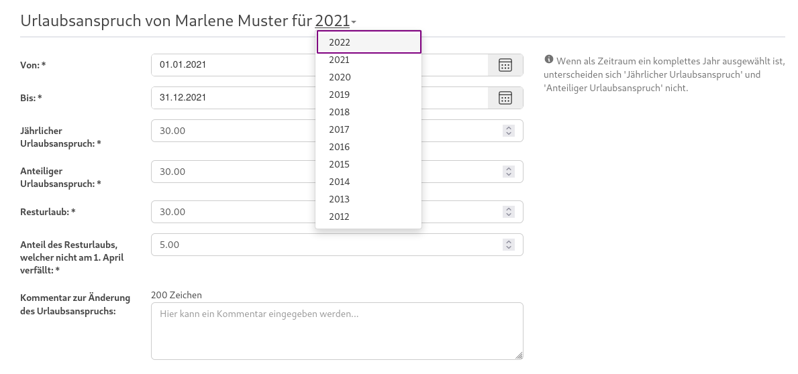

## Welche Berechtigungen gibt es?

In der Urlaubsverwaltung gibt es aktuell folgende Arten von Berechtigungen:

* **inaktiv**: hat keinen Zugang mehr zur Urlaubsverwaltung (Daten des Benutzers bleiben zur Archivierung bestehen)
* **User**: darf Urlaub für sich selbst beantragen
* **Abteilungsleiter**: darf Urlaubsanträge für die Benutzer seiner Abteilungen einsehen, genehmigen und ablehnen
* **Freigabe-Verantwortlicher**: ist bei der zweistufigen Genehmigung von Anträgen verantwortlich für die endgültige Freigabe
* **Chef**: darf Urlaubsanträge aller Benutzer einsehen, genehmigen und ablehnen
* **Office**: darf Einstellungen zur Anwendung vornehmen, Mitarbeiter verwalten, Urlaub für Mitarbeiter beantragen/stornieren und Krankmeldungen pflegen
* **Admin**: Keine fachliche Rolle sondern nur für den Zugriff von Management-Schnittstellen (Spring Boot Actuator).

Es ist geplant, das aktuelle Berechtigungskonzept [feingranularer](https://github.com/synyx/urlaubsverwaltung/issues/467) zu gestalten.

## Welcher Benutzer darf nach der erfolgreichen Installation globale Einstellungen vornehmen?

Nach der erfolgreichen Installation der Urlaubsverwaltung bekommt der erste Benutzer, der sich einloggt, automatisch die Berechtigung:
> darf Einstellungen zur Anwendung vornehmen, die Daten aller Mitarbeiter verwalten, Urlaub für alle Mitarbeiter beantragen/stornieren und Krankmeldungen pflegen

Dies liegt daran, dass der erste Benutzer, der sich einloggt, normalerweise derjenige ist, der globale Einstellungen wie den E-Mail Versand in der Anwendung konfiguriert. Weitere privilegierte Rollen müssen von diesem ersten Benutzer vergeben werden.

Es ist geplant, das aktuelle Berechtigungskonzept [feingranularer](https://github.com/synyx/urlaubsverwaltung/issues/467) zu gestalten.

## Wo kann ich neue Benutzer anlegen?

Die Urlaubsverwaltung nutzt zur Verwaltung von Benutzern einen konfigurierbaren Security Provider. Sobald ein Benutzer sich an der Urlaubsverwaltung anmeldet wird dieser für die Urlaubsverwaltung angelegt. Weitere Details zur Konfiguration des Security Providers sind [hier](https://github.com/synyx/urlaubsverwaltung#security-provider-konfigurieren) zu finden.

## Wie kann ich Benutzer löschen?

Über die Anwendung kann man Benutzer nicht löschen, nur inaktivieren.
Beim Editieren des Benutzers muss folgende Berechtigung ausgewählt werden:
> hat keinen Zugang mehr zur Urlaubsverwaltung (Daten des Benutzers bleiben bestehen)

Mit dieser Berechtigung kann sich der Benutzer nicht mehr einloggen, aber seine Daten bleiben zu Archivierungszwecken bestehen.

## Wieso kann ein Benutzer keinen Urlaub beantragen?

Damit ein Benutzer Urlaub beantragen kann, müssen seine Daten vollständig sein.
In der Regel ist für den Zeitraum des Urlaubsantrags kein Urlaubsanspruch konfiguriert oder keine Arbeitszeiten erfasst.

Unter dem Menüpunkt "Benutzer" sieht man eine Liste der Benutzer.
Mit Klick auf "Details" des betreffenden Benutzers gelangt man zur Übersicht der Daten des Benutzers. Hier können die einzelnen Benutzerdaten wie Stammdaten,
Arbeitszeiten und Urlaubsanspruch durch Klick auf die Editieren-Aktion (Stift-Icon) gepflegt werden. Sobald der Benutzer über alle erforderlichen Daten
verfügt, sollte er auch in der Lage sein, Urlaub zu beantragen.

## Wie kann ich den Urlaubsanspruch eines Benutzers für das nächste Jahr pflegen?

Bei der Übersicht der Benutzerdaten (vgl. obige Frage) gibt es einen Unterpunkt
"Urlaubsanspruch". Die angezeigte Jahreszahl stellt standardmäßig das aktuelle
Jahr dar. Man kann aber auf die Jahreszahl klicken, um ein anderes Jahr
auszuwählen. So kann man bspw. das nächste Jahr auswählen, um den
Urlaubsanspruch für das nächste Jahr einzutragen.

Das manuelle Eintragen des Urlaubsanspruchs für das nächste Jahr ist aber nur
dann notwendig, wenn der Urlaubsanspruch für das nächste Jahr sich vom
diesjährigen unterscheidet. Ansonsten hat der Benutzer im nächsten Jahr einfach
den gleichen Urlaubsanspruch, den er im aktuellen Jahr hat.

## Muss ich den Resturlaub der Benutzer manuell eintragen?

Nein. Zum Anfang eines neuen Jahres (nachts am 1. Januar) läuft automatisch ein
Prozess, der den Resturlaub für das neue Jahr anhand des bis dato genommenen
Urlaubs im alten Jahr berechnet.

Wenn bereits Resturlaub für das nächste Jahr eingetragen wurde, wird dieser
am 1. Januar automatisch überschrieben.
