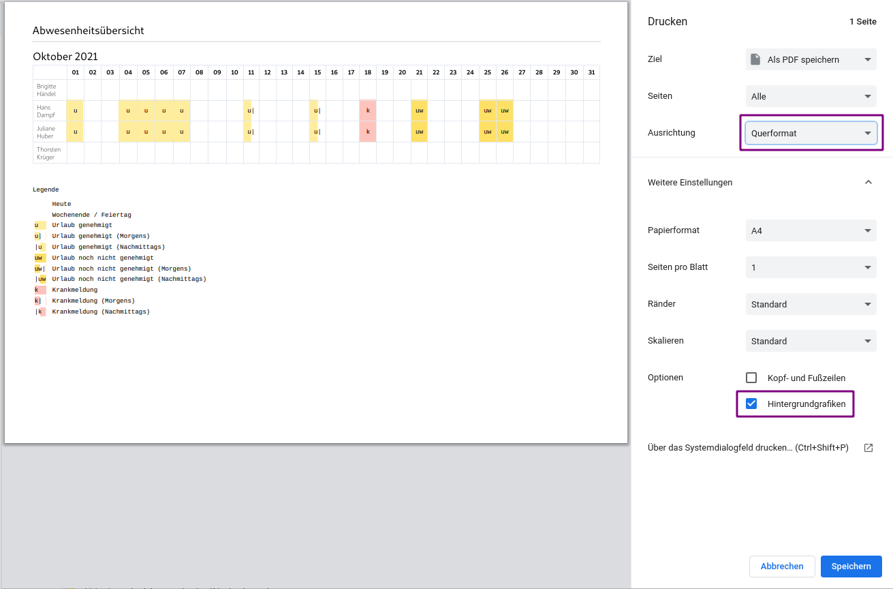
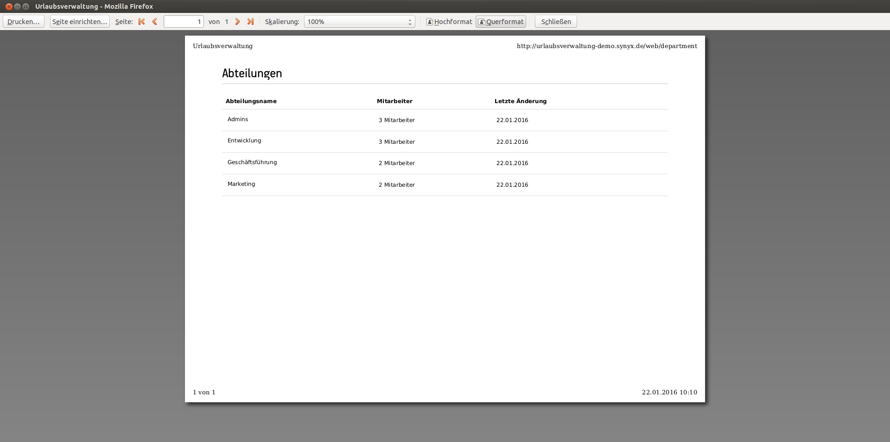

## Wie konfiguriere ich Ausdrucke

Auf manchen Seiten der Urlaubsverwaltung gibt es einen "Drucken" Button. Dieser
löst ein Drucken der aktuellen Webseite aus. Dies ist nur eine Abkürzung, um die
aktuelle Webseite zu drucken. Man könnte auch die Webseite über die
Standard-Druckfunktion des Browsers ausdrucken. Wie man bspw. im Firefox
Webseiten druckt, kann man hier nachlesen:
https://support.mozilla.org/de/kb/Eine-Webseite-drucken

Manche Seiten der Urlaubsverwaltung haben sehr viel horizontalen Inhalt, können
daher nur im Querformat gedruckt werden. Beim Auslösen des Drucks ist dann also
darauf zu achten, dass beim Punkt "Ausrichtung" der Wert "Querformat" aktiviert
ist:

Man kann sich auch eine Druckvorschau anzeigen lassen, wenn man statt über den
"Drucken" Button über die normale Druckfunktion des Browsers druckt. Dann sieht
man auch das jeweilige Verhalten im Quer- und Hochformat,
vgl. 

