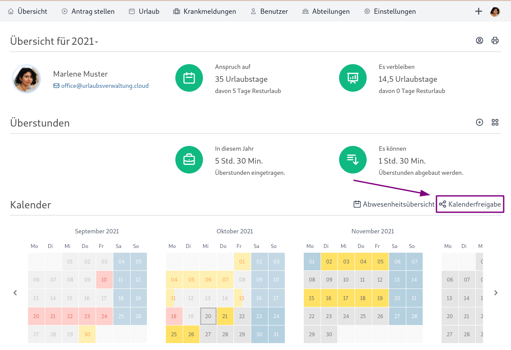
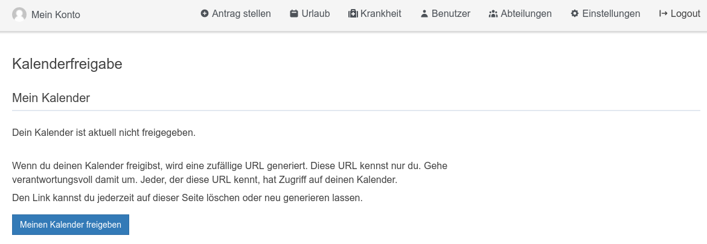

#### Welche Formen der iCal Kalenderfreigabe gibt es?

Die Urlaubsverwaltung bietet die folgenden Möglichkeiten für eine iCal Kalenderfreigabe:

* Mein Kalender: Der Freigabe-Link enthält nur deine Abwesenheiten
* Abteilung: Der Freigabe-Link enthält die Abwesenheiten deiner Abteilung
* Firma: Der Freigabe-Link enthält die Abwesenheiten deiner Firma. Diese Freigabe ist nur möglich, wenn ein Office-Benutzer die Konfigurationsmöglichkeit erlaubt hat.

Diesen Freigabe-Link kennst nur du. Gehe verantwortungsvoll damit um. Jeder, der diese URL kennt, hat Zugriff auf deinen Kalender.

#### Wie kann ich einen Kalender per iCal freigeben?

Die Kalenderfreigabe kann pro Benutzer konfiguriert werden. Um die Konfiguration in der Urlaubsverwaltung durchzuführen sind folgende Schritte zu tun:
1. Klicke auf "Kalenderfreigabe" in der Übersichtsseite oberhalb des Kalenders

2. Wähle z. Bsp. "Meinen Kalender freigeben"

3. Es wird ein geheimer Link generiert, welchen du jetzt zum Abonnieren verwenden kannst. Weitere Infos über das Abonnieren findest du [hier](#welche-m%C3%B6glichkeiten-habe-ich-eine-ical-kalenderfreigabe-in-meinem-client-zu-verwenden).

#### Wie kann ich eine Freigabe löschen?

Eine Freigabe kann über folgende Schritte gelöscht werden:
1. Klicke auf "Kalenderfreigabe" in der Übersichtsseite oberhalb des Kalenders

2. Wähle beim betreffenden Kalender "Freigabe löschen". Durch das Löschen ist der Zugriff über den geheimen Link nicht mehr möglich.

#### Welche Möglichkeiten habe ich eine iCal Kalenderfreigabe in meinem Client zu verwenden?

Hier eine Liste von Anleitungen beliebter Kalenderlösungen, welche die iCal Kalenderfreigabe unterstützen:

* [Apple Calendar](https://support.apple.com/de-de/guide/calendar/icl1022/mac)
* [Google Calendar](https://support.google.com/calendar/answer/37100)
* [Mircosoft Outlook](https://support.microsoft.com/de-de/office/importieren-oder-abonnieren-eines-kalenders-in-outlook-com-cff1429c-5af6-41ec-a5b4-74f2c278e98c)
* [Mozilla Thunderbird](https://support.mozilla.org/de/kb/neue-kalender-erstellen#w_icalendar-ics)

#### Wird die iCal Kalenderfreigabe die bisherigen Kalenderintegrationen wie Exchange und Google Calendar ersetzen?

Ja, wir haben die Kalenderintegration für Google Calendar und Exchange in Version 4 der Urlaubsverwaltung als `deprecated` makiert und werden diese in Version 5 entfernen. Die Integration kann aber ohne weitere Einschränkungen durch die iCal Kalenderfreigabe ersetzt werden.

##### Welche Vorteile bringt mir das?

Durch die iCal Kalenderfreigabe können die Berechtigungen und Sichtbarkeiten feingranular konfiguriert werden, wodurch ein Datenschutz-konformer Einsatz möglich wird.
